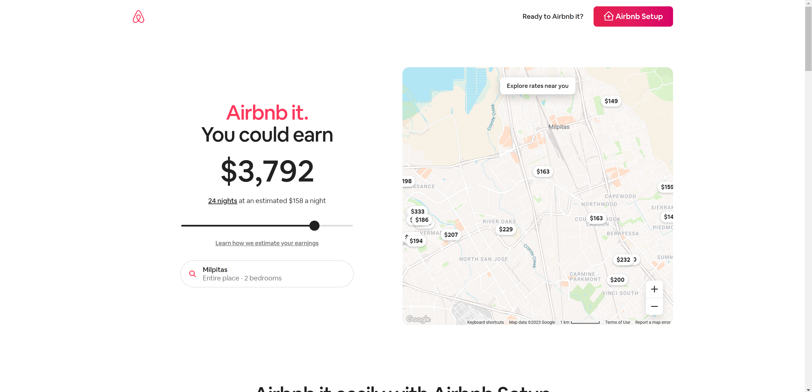
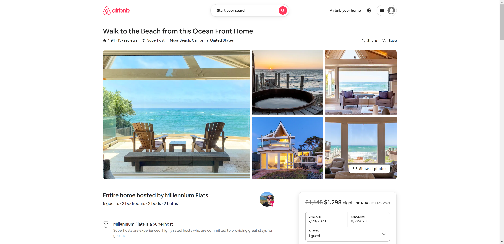

An upcoming project with the goal of recommending recipes/restaurants to its users.

## 1. Introduction
The purpose of this page is to document the specifications for the project, design, and development of this project. It outlines the objectives, scope, and key features of the system.

### 1.1 Project Scope
The objective of the project is to create a food and restaurant recommendation system that provides personalized suggestions to users based on their flavor preferences, dietary restrictions, allergies, location, and context of time.

### 1.2 Risks And Assumptions
To be created

### 1.3 User Requirements
The system should meet the following user requirements:
- Ability to sign up, log in, and manage user profiles
- Easy and intuitive user interface for browing and searching recommendations
- Personalized recommendations based on user data
- Ability to provide feedback or ratings for recommended items

## 2 System Overview
An overview of the system's objectives and goals. 

### 2.1 User Interface Design
Similar landing page design:


Similar explore page design


Similar selected food page design


Similar recommend food page design


### 2.2 Objectives 
- [ ] Create the app, recommendation engine and UI
- [ ] Account for allergies (potentially with [Fig](https://foodisgood.com))
- [ ] Create family groups (personalized meals for families)
- [ ] Social Integration (google log in, sharing to Instagram)
- [ ] Generate weekly or monthly meal plans, select recipes
- [ ] Generate shopping lists based on recipes
- [ ] Allow users to submit own recipes
- [ ] Create review or rating system, which could be factored into recommendation engine
- [ ] Reservations for Restaurants, could use [OpenTable](https://www.opentable.com)


## 3 Functional Specifications

### 3.1 Usecases
- Account for following scenarios:
    - Group of people meeting, account for all preferences
    - Family eating together
    - Account for occasional dislikes, ie don't like eating Japanese today
    - Eating something new, trying new cuisines
    - Family 1 likes restaurant 1, recommend restaurant 1 to family 2

### Data Model
The system's data model will include objects such as: users, recipes, and restaurants. 

**Sample User Data (not finished):**
```json
{
  "user_id": "A1B2C3D4",
  "profile": {
    "age": 30,
    "gender": "female",
    "language": "en",
    "food_preferences": ["Italian", "Vegetarian"],
    "restaurant_preferences": ["Casual Dining", "Mexican"]
  },
  "ratings": [
    {
      "item_id": "recipe_789",
      "rating": 4.5
    },
    {
      "item_id": "restaurant_456",
      "rating": 3.8
    }
  ],
  "interactions": [
    {
      "item_id": "recipe_123",
      "action": "save",
      "timestamp": "2023-06-23T10:15:30Z"
    },
    {
      "item_id": "restaurant_789",
      "action": "click",
      "timestamp": "2023-06-22T18:45:20Z"
    }
  ],
  "context": {
    "time": "lunch",
    "location": {
      "latitude": 37.7749,
      "longitude": -122.4194
    }
  }
}

```

**Sample Restaurant Data** (from yelp)
```json
{
   "business_id":"2wEnpf2eu98rcYc540UN3Q",
   "name":"Chipotle Mexican Grill",
   "address":"4500 N Oracle Rd Fc10",
   "city":"Tucson",
   "state":"AZ",
   "postal_code":"85705",
   "latitude":32.288873,
   "longitude":-110.974068,
   "stars":3.5,
   "review_count":14,
   "is_open":0,
   "attributes":{
      "RestaurantsReservations":"False",
      "RestaurantsTakeOut":"True",
      "RestaurantsPriceRange2":"1",
      "RestaurantsGoodForGroups":"True",
      "RestaurantsAttire":"u'casual'",
      "BikeParking":"False",
      "HasTV":"False",
      "RestaurantsDelivery":"False",
      "OutdoorSeating":"True",
      "GoodForKids":"True",
      "BusinessAcceptsCreditCards":"True",
      "Alcohol":"u'beer_and_wine'"
   },
   "categories":"Restaurants, Fast Food, Mexican",
   "hours":{
      "Monday":"10:45-21:0",
      "Tuesday":"10:45-21:0",
      "Wednesday":"10:45-21:0",
      "Thursday":"10:45-21:0",
      "Friday":"10:45-21:0",
      "Saturday":"10:45-21:0",
      "Sunday":"10:45-21:0"
   }
}
```

**Sample Recipe Data**
To be created


